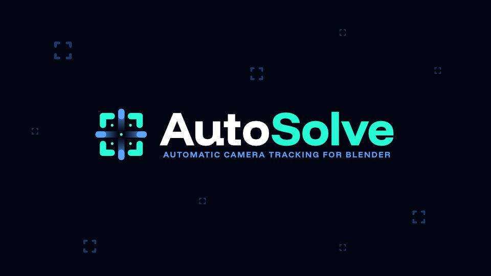
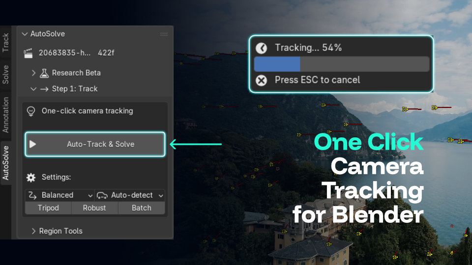
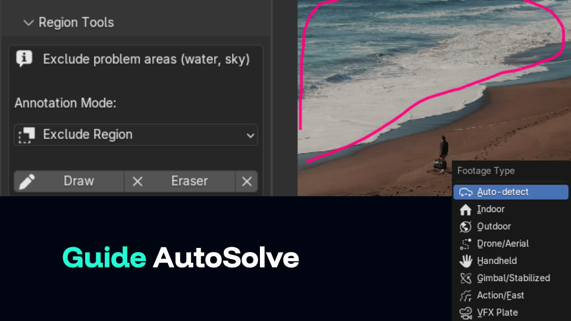
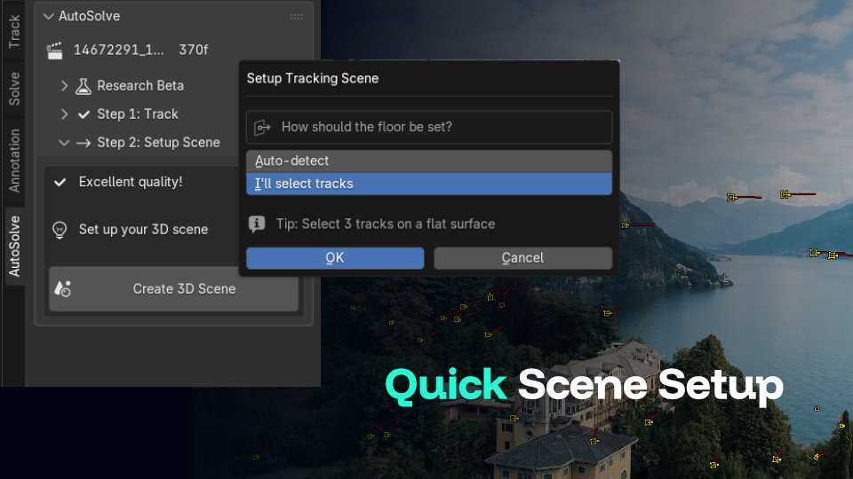
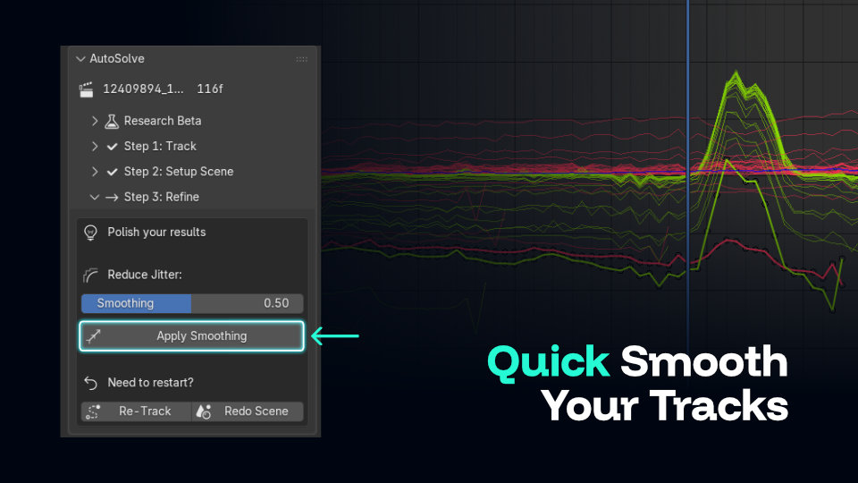

# AutoSolve - Automatic Camera Tracking for Blender

[](https://www.gnu.org/licenses/gpl-3.0)
[](https://www.blender.org/)
[](https://discord.gg/qUvrXHP9PU)
[](https://usamasq.gumroad.com/l/autosolve)



> **"We shouldn't have to leave the open-source ecosystem to get a modern, automated workflow."**
>
> As a VFX teacher, I built **AutoSolve** because I was tired of seeing students turn to paid or cracked software just to get a simple camera solve.
>
> **The Goal:** One-click solves that rival industry giants, built 100% for Blender.

> [!NOTE] > **🧪 Research Beta** - This addon features a **learning system** that improves over time.
> [Contribute your data](#contribute-training-data) to help build the best open-source tracking algorithm!

AutoSolve is a Blender addon that **automates the entire camera tracking workflow** - from feature detection to camera solve. It uses **adaptive learning** to improve tracking quality over time by learning from each session.

## What It Does

| Step                     | Manual Workflow                               | AutoSolve                                                  |
| ------------------------ | --------------------------------------------- | ---------------------------------------------------------- |
| **1. Feature Detection** | Place markers manually or use Detect Features | ✅ Smart detection with balanced region coverage           |
| **2. Tracking**          | Track forward/backward, fix lost markers      | ✅ Bidirectional tracking with automatic replenishment     |
| **3. Track Cleanup**     | Delete short/bad tracks manually              | ✅ Automatic filtering of jittery, short, and spike tracks |
| **4. Camera Solve**      | Run solver, hope for low error                | ✅ Iterative refinement with failure diagnosis             |
| **5. Learning**          | Remember what worked                          | ✅ Learns settings that work for your footage types        |

> **Note:** AutoSolve uses Blender's native tracking - no external dependencies required.

---

## Features

| Feature                    | Description                                                     |
| -------------------------- | --------------------------------------------------------------- |
| **One-Click Tracking**     | Automatic feature detection, tracking, cleanup, and solve       |
| **Adaptive Learning**      | Learns optimal settings from your footage over time             |
| **Smart Detection**        | Balanced marker placement across all screen regions             |
| **Region Control**         | Draw inclusion/exclusion zones to guide the tracker             |
| **Bidirectional Tracking** | Starts from mid-clip for better frame coverage                  |
| **Track Healing**          | Detects drifted tracks and heals gaps with anchor interpolation |
| **Track Averaging**        | Averages nearby track clusters for noise reduction              |
| **Quality Prediction**     | Estimates solve quality before running solver                   |
| **Failure Diagnosis**      | Detects why tracking failed and applies targeted fixes          |
| **Footage Type Presets**   | Optimized settings for DRONE, INDOOR, HANDHELD, etc.            |
| **Zoom Detection**         | Detects zoom/dolly motion from radial velocity patterns         |
| **Smoothing**              | Reduces jitter with track motion smoothing                      |

---

## Requirements

- **Blender 4.2.0** or later
- No external dependencies (uses Blender's native tracking only)

---

## Installation

1. Download from the **Blender Extensions Platform**
2. In Blender: `Edit → Preferences → Add-ons`
3. Click **"Install from Disk"** and select the file
4. Enable the extension

---

## Workflow: 3 Simple Steps

AutoSolve replaces complex menus with a guided, phase-based workflow. In Blender's VFX Workspace, open the Movie Clip Editor and load your footage. Open the AutoSolve panel to the left of the Movie Clip Editor.

### Phase 1: Click & Track

Start by selecting your footage type and clicking the big **Play** button. AutoSolve handles the rest—detecting features, tracking forward/backward, cleaning up bad tracks, and solving.



> **Tip:** Use the **Region Tools** dropdown to draw annotations that guide the tracker to ignore or focus on specific areas.



### Phase 2: Instant Scene Setup

Once tracking is complete, you'll get an immediate quality report. If you're happy with the results, generate your entire 3D scene (camera, background, and ground plane) with a single click.



### Phase 3: Refine & Polish

After your scene is set up, unlock professional refinement tools. Apply smoothing to eliminate camera jitter or easily re-track if you need to make adjustments.



### Options

| Option            | Purpose                                                                      |
| ----------------- | ---------------------------------------------------------------------------- |
| **Quality**       | Controls speed vs accuracy tradeoff                                          |
|                   | **Fast** - Fewer markers (20), faster tracking, lenient thresholds           |
|                   | **Balanced** - Default settings (35 markers), good for most footage          |
|                   | **Quality** - More markers (50), stricter thresholds, best accuracy          |
| **Footage Type**  | Hint for footage characteristics (DRONE, GIMBAL, VFX, etc.)                  |
| **Tripod Mode**   | For nodal pan/tilt shots - uses rotation-only solver, simpler motion model   |
| **Robust Mode**   | For difficult footage - larger search areas, faster monitoring, more markers |
| **Smooth Tracks** | Pre-solve smoothing - reduces marker jitter with Gaussian weighted average   |

---

## Troubleshooting

| Problem               | Solution                                                                |
| --------------------- | ----------------------------------------------------------------------- |
| **Solve failed**      | Enable **Robust Mode** and try again                                    |
| **High error (>1px)** | Use **Quality** preset or try **Tripod Mode** for static shots          |
| **Tracks drifting**   | Use **Region Tools** to exclude problematic areas (sky, water, foliage) |
| **Jittery camera**    | Apply **Smoothing** in Phase 3 after scene setup                        |
| **Not enough tracks** | Lower footage has few features—try a different clip section             |

---

## Support the Project

> 💬 **1,000+ upvotes on Reddit** — [Read the post](https://www.reddit.com/r/blender/comments/1pgg0na/im_tired_of_telling_my_students_to_use_other/) that started this project.

AutoSolve is **free and open-source**. If you find it useful:

- ⭐ **Star** this repo on GitHub
- 📊 **[Contribute tracking data](#contribute-training-data)** — help improve the AI
- ☕ **[Support on Gumroad](https://usamasq.gumroad.com/l/autosolve)** — pay what you want
- 💬 **[Join Discord](https://discord.gg/qUvrXHP9PU)** — community discussions

### 1. Test and Report Issues

- **Found a bug?** Open an [issue on GitHub](https://github.com/usamasq/AutoSolve/issues)
- **Feature request?** Share on [Discord](https://discord.gg/qUvrXHP9PU)

### 2. Contribute Training Data

AutoSolve gets smarter through community data. Your anonymized tracking sessions help improve defaults for everyone.

**How to share your data:**

1. In Blender: `Movie Clip Editor → AutoSolve → Training Data → Export`
2. Upload to the [HuggingFace dataset](https://huggingface.co/datasets/UsamaSQ/autosolve-telemetry)
3. Join [Discord](https://discord.gg/qUvrXHP9PU) for community discussions

**What's collected:**

- ✅ Settings used (pattern size, correlation, etc.)
- ✅ Success/failure metrics per region
- ✅ feature_density (multi-frame sampling at 25%, 50%, 75%)
- ✅ Per-marker survival tracking and quality scores
- ✅ Solve error and track statistics
- ❌ NO file paths, images, or personal data

### 3. Contribute Code

See the [Contributing Guide](#contributing) below.

---

## Contributing

### Getting Started

```bash
git clone https://github.com/usamasq/AutoSolve.git
cd AutoSolve
```

### Project Structure

```
autosolve/
├── __init__.py          # Package registration
├── operators.py         # Main operators (Auto-Track & Solve, training tools)
├── properties.py        # Scene properties and settings
├── ui.py               # N-Panel UI in Movie Clip Editor
├── clip_state.py       # Multi-clip state manager
└── tracker/             # Core tracking engine
    ├── smart_tracker.py      # Main tracking orchestrator with learning
    ├── analyzers.py          # TrackAnalyzer & CoverageAnalyzer classes
    ├── validation.py         # ValidationMixin - pre-solve validation
    ├── filtering.py          # FilteringMixin - track cleanup & averaging
    ├── averaging.py          # TrackAverager - cluster averaging for noise reduction
    ├── smoothing.py          # Track smoothing utilities
    ├── constants.py          # Shared constants (REGIONS, TIERED_SETTINGS)
    ├── utils.py              # Utility functions (get_region, etc.)
    └── learning/             # Learning components
        ├── session_recorder.py        # Session telemetry collection
        ├── settings_predictor.py      # Optimal settings prediction
        ├── feature_extractor.py       # Visual feature extraction
        ├── behavior_recorder.py       # User behavior recording
        ├── failure_diagnostics.py     # Failure analysis & fixes
        ├── track_healer.py            # Gap healing with anchor interpolation
        └── pretrained_model.json      # Bundled community defaults
```

### Key Files to Understand

| File                     | Purpose                                 |
| ------------------------ | --------------------------------------- |
| `smart_tracker.py`       | Main tracking logic, settings, learning |
| `operators.py`           | Modal pipeline phases                   |
| `failure_diagnostics.py` | Failure pattern detection               |
| `feature_extractor.py`   | Visual density & quality analysis       |

### Documentation

- **[ARCHITECTURE.md](ARCHITECTURE.md)** - Code structure and data flow
- **[TRAINING_DATA.md](TRAINING_DATA.md)** - Learning system details

---

## Planned Features

### Implemented ✅

- [x] **Track Healing** - Detects drifted/dislocated tracks and heals gaps
- [x] **Track Averaging** - Averages nearby track clusters for noise reduction
- [x] **Zoom Detection** - Identifies zoom/dolly motion from radial velocities
- [x] **UI for footage type selection** - Dropdown in panel
- [x] **Setup Tracking Scene** - Auto-create camera and background
- [x] **Multi-frame Feature Density** - Temporal texture analysis
- [x] **Per-Marker Quality Tracking** - Survival prediction data
- [x] **Real-time Motion Estimation** - Motion confidence analysis
- [x] **Behavior Learning** - Learns from user corrections (2+ samples)

### Future Roadmap

- [ ] **Community Model Sync** - Download aggregated best settings
- [ ] **XGBoost Settings Model** - Lightweight ML model when >500 sessions collected
- [ ] **Deep Learning (Long Term)** - LSTM/RNN for trajectory prediction (>10k sessions)

---

## Data for Training

Want to help build the best tracking algorithm? Here's how to collect quality training data:

### Optimal Footage for Training

| Type                      | Examples                | Why Useful                   |
| ------------------------- | ----------------------- | ---------------------------- |
| **Varied motion**         | Handheld, gimbal, drone | Tests different search sizes |
| **Different resolutions** | 720p, 1080p, 4K         | Tests scaling behavior       |
| **Challenging scenes**    | Low light, motion blur  | Tests robust mode            |
| **Clean plates**          | Studio, VFX shoots      | Baseline performance         |

### Labeling Your Data

When exporting, add context to your email:

```
Footage: Drone beach flyover
Resolution: 4K
FPS: 24
Result: Success / Fail
Notes: Required 2 retries, edges struggled
```

### Submit Data

**Primary Method:** Upload to [HuggingFace dataset](https://huggingface.co/datasets/UsamaSQ/autosolve-telemetry)

**Community Support:** Join [Discord](https://discord.gg/qUvrXHP9PU) for questions and discussions

Please refer to **[CONTRIBUTING_DATA.md](CONTRIBUTING_DATA.md)** for:

- ✅ Data privacy details
- ✅ Export instructions
- ✅ Data quality guidelines

---

## License

**GPL-3.0-or-later**

---

## Credits

**Developer:** Usama Bin Shahid — Rawalpindi, Pakistan 🇵🇰  
**Contact:** usamasq@gmail.com

_Your contributions make this better for everyone!_
