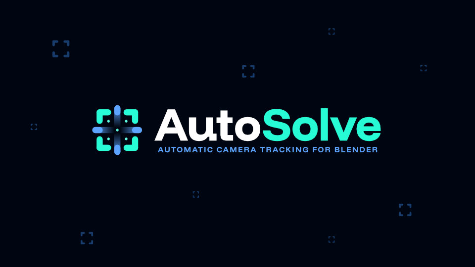
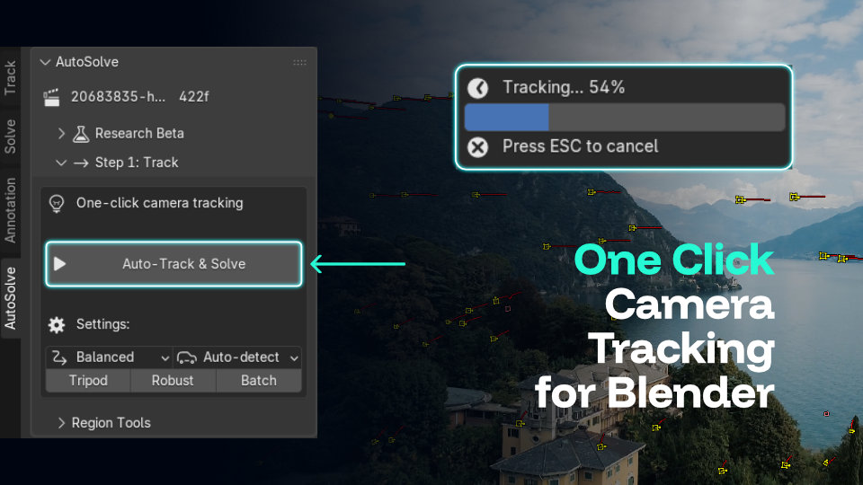
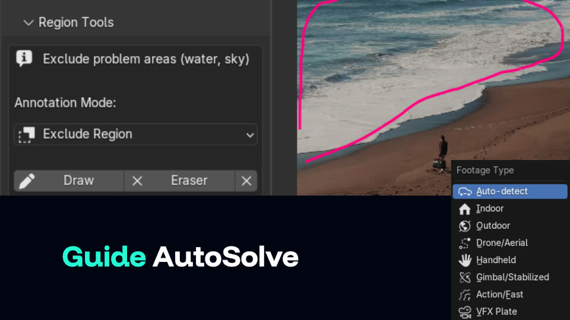
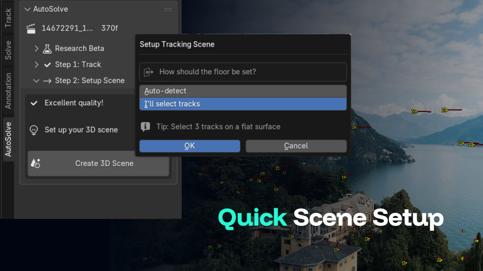
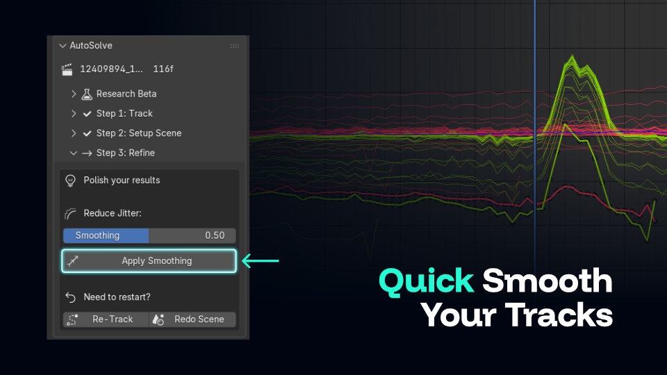

# AutoSolve - Automatic Camera Tracking for Blender

[](https://www.gnu.org/licenses/gpl-3.0)
[](https://www.blender.org/)
[](https://discord.gg/qUvrXHP9PU)
[](https://usamasq.gumroad.com/l/autosolve)



> **"We shouldn't have to leave the open-source ecosystem to get a modern, automated workflow."**
>
> AutoSolve automates Blender's camera tracking workflow with smart defaults, quality-aware cleanup, and automatic failure recovery. Supports both 100% native Blender tracking and advanced deep-learning AI backends completely offline.

AutoSolve is a Blender addon that **automates the entire camera tracking workflow** - from feature detection to camera solve. It handles the manual steps dynamically to give you a solid solve in one click, supporting both native Blender engines and state-of-the-art AI networks (CoTracker v3, YOLOv8) via an out-of-process worker.

[Watch Launch Video](https://youtu.be/NzI5vurW5C4)

---

## What It Does

| Step                     | Manual Workflow                               | AutoSolve (Native & AI)                                    |
| ------------------------ | --------------------------------------------- | ---------------------------------------------------------- |
| **1. Feature Detection** | Place markers manually or use Detect Features | ✅ Smart grid detection or dense tracking                   |
| **2. Tracking**          | Track forward/backward, fix lost markers      | ✅ Bidirectional native KLT or CoTracker v3 (AI)           |
| **3. Track Cleanup**     | Delete short/bad tracks manually              | ✅ Automatic ML validation or YOLOv8 (AI) dynamic masking  |
| **4. Camera Solve**      | Run solver, hope for low error                | ✅ Iterative native solve or Precision SciPy Solver (AI)   |

> **Note:** AutoSolve works 100% offline. Heavy AI backends run via an out-of-process worker using your system Python to keep Blender's UI responsive and stable.

---

## Features

| Feature                    | Description                                                     |
| -------------------------- | --------------------------------------------------------------- |
| **One-Click Tracking**     | Automatic feature detection, tracking, cleanup, and solve       |
| **CoTracker v3 (AI)**       | Dense transformer tracking across dynamic moves, fast pans, and severe occlusions |
| **Dynamic Masking (AI)**    | Automatically ignores non-rigid elements (people, vehicles, pets) utilizing YOLOv8 |
| **Precision Solver (AI)**   | Custom SciPy bundle adjustment utilizing Trust Region Reflective with robust Cauchy loss |
| **Smart Detection**        | Balanced marker placement across all screen regions             |
| **Region Control**         | Draw inclusion/exclusion zones using annotations to guide the tracker |
| **Bidirectional Tracking** | Starts from mid-clip for better frame coverage                  |
| **Track Healing**          | Detects drifted tracks and heals gaps with anchor interpolation |
| **Track Quality Predictor**| Proactively retires weak tracks using a numpy MLP model before they fail |
| **Content-Aware Placement**| Grid samples luminance variance to skip uniform areas (sky, walls) and scale targets |
| **Track Averaging**        | Averages nearby track clusters for noise reduction              |
| **Failure Diagnosis**      | Detects why tracking failed and applies targeted fixes          |
| **Footage Type Presets**   | Optimized settings for DRONE, INDOOR, HANDHELD, etc.            |
| **Zoom Detection**         | Detects zoom/dolly motion from radial velocity patterns         |
| **Smoothing**              | Reduces jitter with track motion smoothing                      |
| **100% Offline Support**   | Pre-bundled ONNX Runtime wheels and model weights out-of-the-box |

---

## Requirements

- **Blender 4.2.0** or later
- **System Python Interpreter** (only if using AI backends; requires `torch`, `scipy`, `opencv-python`, and `ultralytics` installed on your system environment)
- **Nvidia GPU / Apple Silicon GPU** (Highly recommended for fast AI tracking and segmentation)

---

## Installation

1. Download from the **Blender Extensions Platform**
2. In Blender: `Edit → Preferences → Add-ons`
3. Click **"Install from Disk"** and select the file
4. Enable the extension

---

## Workflow: 3 Simple Steps

AutoSolve replaces complex menus with a guided, phase-based workflow. In Blender's VFX Workspace, open the Movie Clip Editor and load your footage. Open the AutoSolve panel to the left of the Movie Clip Editor.

### Phase 1: Click & Track

Start by selecting your footage type and clicking the big **Play** button. AutoSolve handles the rest—detecting features, tracking forward/backward, cleaning up bad tracks, and solving.



> **Tip:** Use the **Region Tools** dropdown to draw annotations that guide the tracker to ignore or focus on specific areas.



### Phase 2: Instant Scene Setup

Once tracking is complete, you'll get an immediate quality report. If you're happy with the results, generate your entire 3D scene (camera, background, and ground plane) with a single click.



### Phase 3: Refine & Polish

After your scene is set up, unlock professional refinement tools. Apply smoothing to eliminate camera jitter or easily re-track if you need to make adjustments.



### Options

| Option            | Purpose                                                                      |
| ----------------- | ---------------------------------------------------------------------------- |
| **Quality**       | Controls speed vs accuracy tradeoff                                          |
|                   | **Fast** - Faster tracking, lenient thresholds                               |
|                   | **Balanced** - Good defaults, suitable for most footage                      |
|                   | **Quality** - Stricter thresholds, best accuracy                             |
| **Footage Type**  | Hint for footage characteristics (DRONE, GIMBAL, VFX, etc.)                  |
| **Tripod Mode**   | For nodal pan/tilt shots - uses rotation-only solver, simpler motion model   |
| **Robust Mode**   | For difficult footage - larger search areas, faster monitoring, more markers |
| **Smooth Tracks** | Pre-solve smoothing - reduces marker jitter with Gaussian weighted average   |

---

## Troubleshooting

| Problem               | Solution                                                                |
| --------------------- | ----------------------------------------------------------------------- |
| **Solve failed**      | Enable **Robust Mode** and try again                                    |
| **High error (>1px)** | Use **Quality** preset or try **Tripod Mode** for static shots          |
| **Tracks drifting**   | Use **Region Tools** to exclude problematic areas (sky, water, foliage) |
| **Jittery camera**    | Apply **Smoothing** in Phase 3 after scene setup                        |
| **Not enough tracks** | Lower footage has few features—try a different clip section             |

---

## Support the Project

💬 **1,000+ upvotes on Reddit** — [Read the post](https://www.reddit.com/r/blender/comments/1pgg0na/im_tired_of_telling_my_students_to_use_other/) that started this project.

AutoSolve is **free and open-source**. If you find it useful:

- ⭐ **Star** this repo on GitHub
- ☕ **[Support on Gumroad](https://usamasq.gumroad.com/l/autosolve)** — pay what you want
- 💬 **[Join Discord](https://discord.gg/qUvrXHP9PU)** — community discussions

---

## Contributing

### Getting Started

```bash
git clone https://github.com/usamasq/AutoSolve.git
cd AutoSolve
```

### Project Structure

```
autosolve/
├── __init__.py          # Package registration
├── operators.py         # Main operators (Auto-Track & Solve, setup scene, etc.)
├── properties.py        # Scene properties and settings
├── ui.py               # N-Panel UI in Movie Clip Editor
├── clip_state.py       # Multi-clip state manager
├── models/             # Bundled offline AI model weights
│   ├── yolov8n-seg.pt       # YOLOv8 segmentation model checkpoint
│   └── cotracker3_offline.pth # CoTracker v3 offline tracking checkpoint
├── worker/             # External out-of-process Python worker
│   ├── server.py            # JSON-IPC socket server listening on port 47832
│   ├── client.py            # Addon client interface to spawn & control worker
│   ├── cotracker_runner.py  # Wrapper script executing offline CoTracker
│   ├── sam2_runner.py       # Wrapper script executing offline YOLOv8 masking
│   ├── ba_solver.py         # SciPy Trust Region Reflective bundle adjustment solver
│   └── cotracker_src/       # Cloned local CoTracker repository source
└── tracker/             # Core tracking engine
    ├── __init__.py           # Tracker package registration
    ├── smart_tracker.py      # Main tracking orchestrator (inherits all mixins)
    ├── validation.py         # ValidationMixin - pre-solve validation
    ├── filtering.py          # FilteringMixin - track cleanup & averaging
    ├── probe_cache.py        # ProbeCacheMixin - motion probe execution & caching
    ├── detection.py          # DetectionMixin - region feature detection
    ├── strategic.py          # StrategicMixin - strategic timeline loops & gap filling
    ├── learning.py           # LearningMixin - presets adaptation & dead zone learning
    ├── cleanup.py            # CleanupMixin - clustered track cleanups & lost track extensions
    ├── analyzers.py          # TrackAnalyzer & CoverageAnalyzer classes
    ├── averaging.py          # TrackAverager - cluster averaging for noise reduction
    ├── smoothing.py          # Track smoothing utilities
    ├── constants.py          # Shared constants (REGIONS, TIERED_SETTINGS)
    ├── utils.py              # Utility functions (get_region, etc.)
    ├── failure_diagnostics.py # Failure analysis & fixes
    ├── track_healer.py       # Gap healing with anchor interpolation
    ├── feature_density.py    # Temporal texture analysis
    ├── track_predictor.py    # Numpy-only MLP survival inference engine
    ├── models/
    │   └── track_predictor.json  # Exported Track Quality Predictor weights
    └── presets/
        ├── defaults.json     # Bundled community default presets
        └── region_weights.json # Empirical track survivability region weights

ml/
├── AutoSolve_Training.ipynb   # Unified Jupyter training notebook (Settings & Track)
├── beginner_training_guide.md # Beginner-friendly step-by-step training guide
├── extract_video_features.py  # OpenCV video feature extraction script
├── extract_cotracker_trajectories.py # PyTorch/CoTracker trajectory extractor
├── collect_data.py           # Headless validation/collection script (Blender)
├── run_collection.py         # Batch runner for Blender validation/collection
├── prepare_dataset.py        # Dataset preprocessing for settings optimizer
├── train_settings_model.py   # Train Settings expected reward PyTorch model
├── train_track_predictor.py  # Train Track Quality Predictor PyTorch model
├── train_patch_rigidity.py   # Train CNN model for temporal patch rigidity
├── train_trackability_model.py # Calculate empirical region weights
├── export_numpy_model.py     # Export predictor weights to JSON
├── evaluate_model.py         # Evaluate settings expected reward model
├── export_defaults.py        # Grid-search and export optimal settings presets
└── schema.py                 # Dataclasses and serialization schemas for collection

```

---

## License

**GPL-3.0-or-later**

---

## Credits

**Developer:** Usama Bin Shahid — Rawalpindi, Pakistan 🇵🇰  
**Contact:** usamasq@gmail.com
