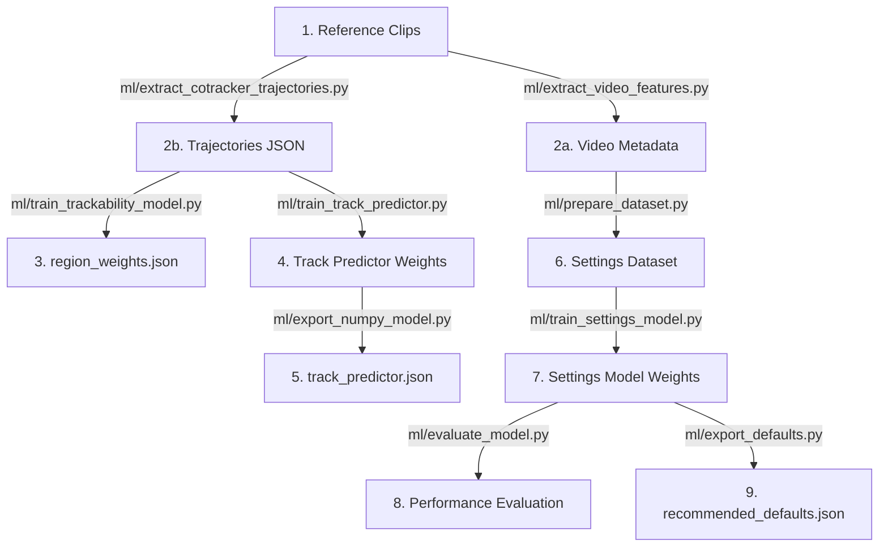

# AutoSolve Model Training Guide

This guide describes how to extract tracking datasets directly from video clips and train/evaluate the machine learning models used in AutoSolve.

All training scripts support **zero-dependency fallback modes** which generate heuristic defaults if PyTorch/NumPy are missing from your global environment.

---

## Workflow Overview



---

## 1. Setup Reference Clips
To build a dataset, you must gather a set of CC-licensed tracking reference clips (covering different movement characteristics, panning, and resolutions). Refer to the guidelines in [ml/clips/README.md](file:///c:/Users/usama/OneDrive/Desktop/AutoSolve/ml/clips/README.md) to categorize your footage. Place clips in a local directory (e.g. `ml/clips/`).

---

## 2. Ingestion & Trajectory Extraction
Bypassing Blender, we extract video features and track trajectories directly in PyTorch using Meta's **CoTracker** (with an OpenCV Lucas-Kanade fallback).

```bash
# Step 2a: Extract video features (motion speed, zoom divergence, distortion curvature, noise)
python ml/extract_video_features.py --clips-dir ml/clips/ --out-dir ml/data/raw/

# Step 2b: Extract point trajectories and simulate settings variations (with noise/occlusions)
python ml/extract_cotracker_trajectories.py --clips-dir ml/clips/ --out-dir ml/data/raw/
```

### Jupyter Notebook Alternative
Alternatively, you can run the entire feature extraction, simulation, and training pipeline interactively in the standalone [AutoSolve_Training.ipynb](file:///c:/Users/usama/OneDrive/Desktop/AutoSolve/ml/AutoSolve_Training.ipynb) (designed for zero-dependency execution in Google Colab with GPU acceleration). 

This notebook requires no repository reference and supports:
* **Google Drive Integration:** Automatic loading and saving of clips directly from `AutoSolve_ML_Data/clips/` in your Drive.
* **AI Extraction (CoTracker & YOLOv8):** Runs high-accuracy Meta CoTracker v3 tracking and YOLOv8 object segmentation on GPU, downloading model weights automatically from Hugging Face.
* **CPU & OpenCV Fallbacks:** If run on a CPU runtime or without installing these packages, the notebook automatically falls back to OpenCV's Shi-Tomasi/Lucas-Kanade flow tracker and standard video features to ensure a 100% crash-proof run.
* **Incremental Processing:** Skips already-processed clips to save execution time.
* **Zipped Downloader:** Compiles and packs all 10 trained models, metadata, and presets into `autosolve_models.zip` for instant browser download.

### Validate Raw Dataset
Verify the integrity of the collected solve logs:
```bash
python ml/validate_data.py --data-dir ml/data/raw/
```

---

## 3. Train Trackability Heatmap / Region Weights (Milestone 5)
Aggregate region survival rates from the collected tracking runs to generate the region trackability table:

```bash
# Aggregates raw logs and writes to the addon's presets directory
python ml/train_trackability_model.py --data-dir ml/data/raw/ --output-json autosolve/tracker/presets/region_weights.json
```

---

## 4. Train Track Quality Predictor (Milestone 4)
Trains the neural network that predicts if an active track is likely to fail in the next 20 frames.

### Step 4a: Train PyTorch MLP
```bash
# Trains 15 -> 64 -> 32 -> 1 classification MLP
python ml/train_track_predictor.py --data-dir ml/data/raw/ --out-dir ml/runs/track_predictor/ --epochs 100
```

### Step 4b: Export to NumPy JSON Weights
Export the trained state dict to standard JSON arrays for native NumPy runtime inference:
```bash
python ml/export_numpy_model.py --input-json ml/runs/track_predictor/model_meta_weights.json --output-path autosolve/tracker/models/track_predictor.json
```

---

## 5. Train Settings Optimizer (Milestone 6)
Fits the expected reward model that predicts solve quality given candidate parameters.

### Step 5a: Preprocess and Scale Dataset
Extracts 24-dimensional feature vectors, calculates solve rewards, and normalizes inputs:
```bash
python ml/prepare_dataset.py --data-dir ml/data/raw/ --output-json ml/data/processed/settings_dataset.json
```

### Step 5b: Train Expectation Model
Trains the expected reward MLP:
```bash
python ml/train_settings_model.py --data-path ml/data/processed/settings_dataset.json --out-dir ml/runs/settings_optimizer/ --epochs 50
```

### Step 5c: Evaluate Model Performance
Validate predictions and check MAE/MSE accuracy on the validation split:
```bash
python ml/evaluate_model.py --data-path ml/data/processed/settings_dataset.json --model-path ml/runs/settings_optimizer/model_meta_weights.json
```

### Step 5d: Run Presets Grid Search & Recommendation
Performs parameter search grid sweeps using the MLP predictor to select optimal presets per clip type:
```bash
python ml/export_defaults.py --model-path ml/runs/settings_optimizer/model_meta_weights.json --output-json ml/runs/settings_optimizer/recommended_defaults.json
```
*Note: Developers should manually review recommendations inside `recommended_defaults.json` and merge them into `PRETRAINED_DEFAULTS` inside `autosolve/tracker/constants.py`.*

---

## 6. Phase 2: Addon Validation (Headless Blender solves)
To verify that the trained models translate to high-quality solves under actual Blender conditions, run the validation script which launches background Blender tasks to track and solve clips:

```bash
# Run validation solves over your clips using the new models
python ml/run_collection.py --clips-dir ml/clips/ --output-dir ml/data/validation/ --blender-bin "path/to/blender"
```
This output can be compared to benchmark performance to verify accuracy.
